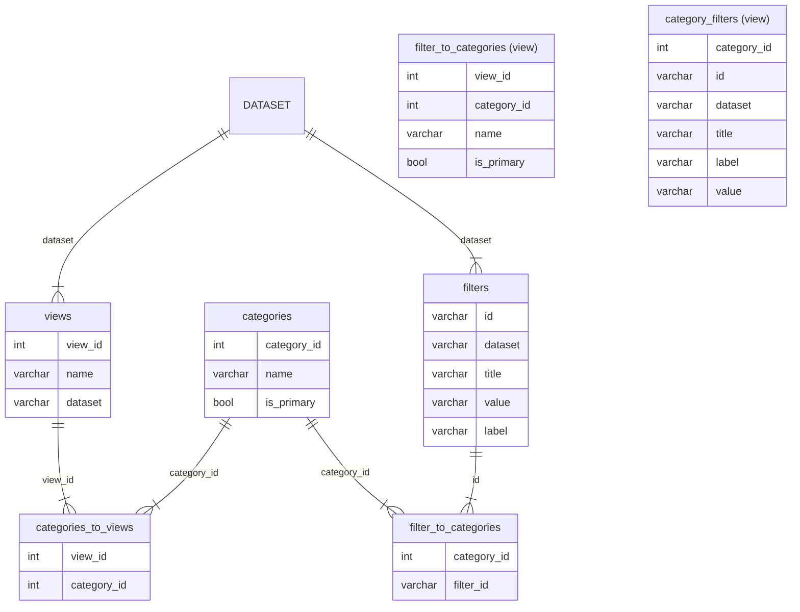

# AMR ETL

A script for generating a AMR release database.

## Inputs

`usage: main.py [-h] -r RELEASE -c CONFIG -d DATA [-v SCHEMA]`

The ETL requires :-
- a release name, this can be any string.
- a config, a JSON file that describes the views, filters, and default columns needed by the AMR portal
- data description, a JSON file describing datasets, filters, and any  columns needed
- optionally you can provide a directory for the JSON schema files used to validate the config and data json files
### Config

Describes three objects :-
- views - A set of views that are used to explore the AMR data. A view consists of a name, a dataset, a category group, and other category groups.
- filterCategories - A series of filter categories use to generate the filters for a the views
- special_columns - A set of column names and transform properties. This is used to alter the name, type, visibility, and sorting rules for a named, for a column

| Property                                 | Type     | Required | Possible values | Deprecated | Default | Description                                                | Examples |
| ---------------------------------------- | -------- | -------- | --------------- | ---------- | ------- | ---------------------------------------------------------- | -------- |
| filterCategories                         | `object` | ✅        | object          |            |         |                                                            |          |
| views                                    | `array`  | ✅        | object          |            |         |                                                            |          |
| views[].name                             | `string` | ✅        | string          |            |         | Display name of view                                       |          |
| views[].dataset                          | `string` | ✅        | string          |            |         | Sets which dataset is used by the view                     |          |
| views[].categoryGroups                   | `array`  | ✅        | object          |            |         | Main category groups for this view                         |          |
| views[].categoryGroups[].name            | `string` |          | string          |            |         | Display name for category group                            |          |
| views[].categoryGroups[].categories      | `array`  |          | string          |            |         |                                                            |          |
| views[].otherCategoryGroups              | `array`  |          | object          |            |         | List of additional category groups avaliable for this view |          |
| views[].otherCategoryGroups[].name       | `string` |          | string          |            |         | Display name for category group                            |          |
| views[].otherCategoryGroups[].categories | `array`  |          | string          |            |         |                                                            |          |
| special_columns                          | `object` |          | object          |            |         |                                                            |          |
Example: **amr-portal/scripts/etl/test/config.json**
Schema: **amr-portal/scripts/etl/schema/config.json**

### Data

| Property                 | Type   | Required | Possible values | Deprecated | Default | Description                                                                                                   | Examples                     |
| ------------------------ | ------ | -------- | --------------- | ---------- | ------- | ------------------------------------------------------------------------------------------------------------- | ---------------------------- |
| name                     | string | ✅        |                 |            |         | Dataset name                                                                                                  |                              |
| path                     | string | ✅        |                 |            |         | Location of CSV                                                                                               |                              |
| filter                   | string |          |                 |            |         | Location to a text file containing newline (\N) delimited list of values. Must be used with **filter_column** |                              |
| filter_column            | string |          |                 |            |         | The name of the column found in the path CSV to filter against. Must be used with **filter**                  |                              |
| create_columns           | array  |          |                 |            |         | An array of columns to be created as part of the dataset                                                      |                              |
| create_columns[].name    | string | ✅        |                 |            |         | Name of the new column to create. I have been prefixing with 'gen_'                                           |                              |
| create_columns[].command | string | ✅        |                 |            |         | SQL statement used to generate the values for the new column                                                  | `CONCAT(genus,' ', species)` |
Example: **amr-portal/scripts/etl/test/data.json**
Schema: **amr-portal/scripts/etl/schema/dataset.json**
## Running

`uv run python main.py -r alpha_v3 -c test/config.json -d test/data.json`

## DuckDB Schema

